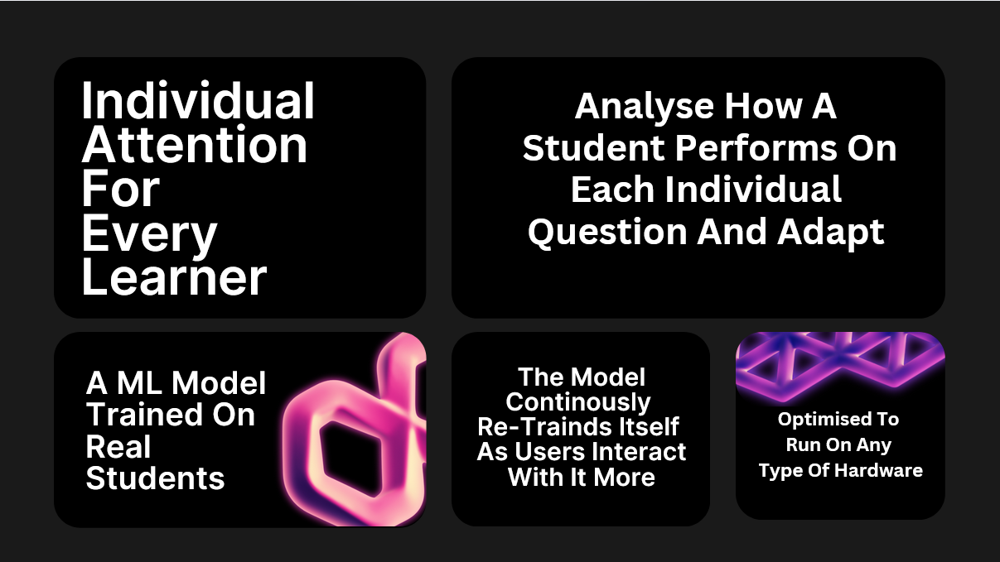
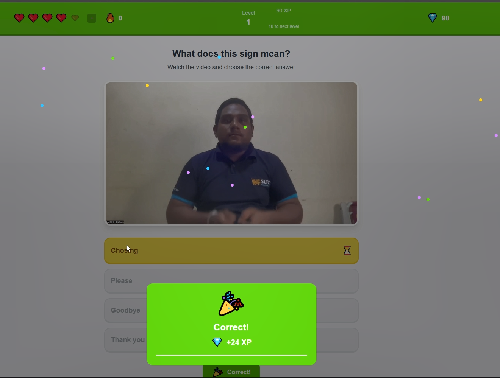
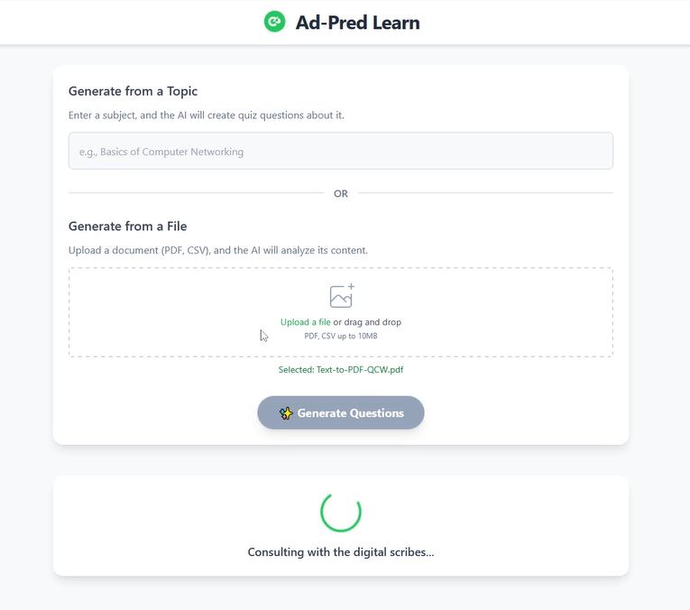

# AD - PRED

A smart flashcard app that can generate questions automatically using LLMs.  
Each interaction between the user and a question is fed into an ML model trained on real data  
to predict the probability of the user getting the next question correct.  
The question pool is then ordered to deliver the most optimized learning experience.

## Getting Started

For setup and installation instructions, see [How to Run App](README_How_to_run_app.md).

## Right Now

We focused on specializing the Ad-Pred platform into a sign language teaching app  
to demonstrate its capability to adapt to any type of educational content.

## Architecture

- **Frontend**: Next.js with TypeScript  
- **Backend**: Node.js/Express with TypeScript  
- **AI Engine**: Python Flask microservice for repetition learning  
- **Database**: MySQL  
- **Integration Engine Microservices**: React frontend LLM connection via Gemini API
